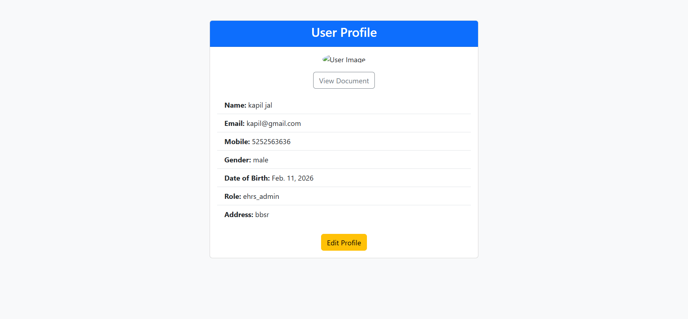
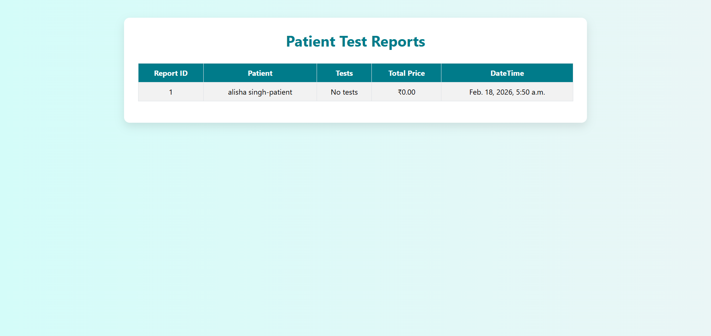

# electronic_hospital_record_management_system (ehrs)

## About The Project
The Electronic Hospital Record Management System (EHRS) is a web-based application designed to manage patient records digitally. 
It helps hospitals efficiently store, retrieve, and manage medical records in a secure and organized way.

This system reduces paperwork, improves accessibility, and enhances overall hospital workflow.

---

## 🚀 Features

- 👨‍⚕️ Doctor Management
- 🧑‍🤝‍🧑 Patient Registration
- 📋 Electronic Medical Records
- 🗂 Appointment Scheduling
- 🔐 Secure Login & Authentication
- 🔎 Search and Filter Records
- 📝 Real-time updates using AJAX

---

## 🛠 Tech Stack

### Backend
- Python
- Django

### Frontend
- HTML
- CSS
- JavaScript
- AJAX

### Database
- SQLite

---
## 📷 Screenshots

### 🏠 Home Page

### Our services

### 🔐 Login Page

### registration page

### 📋admin Dashboard

### 📋doctor Dashboard

### 📋staff Dashboard

### 📋patient Dashboard

### user profile

### Test_report page

### Backend_view page

### Recent_registrations page

### 🔐Total user data page

1. Clone the repository
https://github.com/Dk455-sk/electronic_hospital_record_management_system.git

2. Navigate to project folder

3. Create virtual environment

4. Activate virtual environment

5. Install dependencies

6. Run migrations

7. Start server

---

## 🎯 Future Improvements
- Deploy on cloud server
- Add email notifications
- Improve UI/UX
- Add patient dashboard

---

## 👨‍💻 Author
Er.Kapildev Surujal
